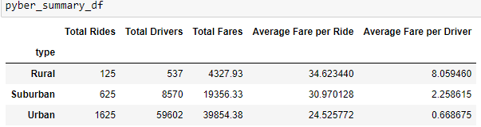
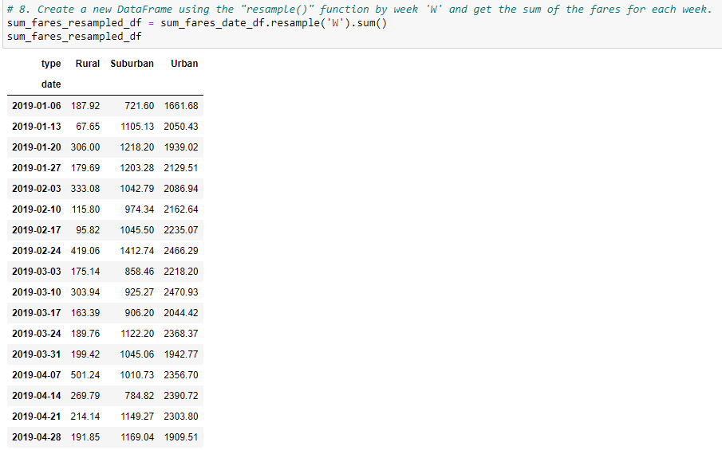

# PyBer Analysis

## Overview of Project

### Purpose
	The purpose of the analysis is to create a summary DataFrame of the ride sharing data by city type and
display a multi-line graph of weekly fares for the three city types. 

## Results

In general, the number of rides, drivers, and total fare amount all increase in an area as the area is more populated. That is,
urban areas have the highest values, then suburban, then rural for these metrics. The average fare per ride and average fair 
per driver have the opposite correlation, where the more ppopulated areas have lower values. This may be due to larger distances
and therefore more time spent per ride in less densely populated areas. Shorter rides may occur in more densely populated areas. 

The weekly summary DataFrame and chart show that urban areas have the highest total fares and suburban values are greater than
rural values. These differences in value are consistent across the time period shown and do not seem to have any time periods 
where the fare values greatly fluctuate in a given area. 

## Summary
-Provide three recommendations for addressing disparities among the city types.
1. To increase demand for rides in rural and suburban ares, advertise against drunk driving and recommend ride-sharing.
2. To increase drivers in rural and suburban areas, advertise the flexibility of schedule for working as a ride-share driver.
3. To increase fare per driver in urban areas, reorganize drivers by a tiered status based on number of drives per day or week. 
This will decrease the importance of drivers who complete very few rides in a given timeframe and encourage drivers 
to generate more rides when they see the fare per driver in a different tier.
